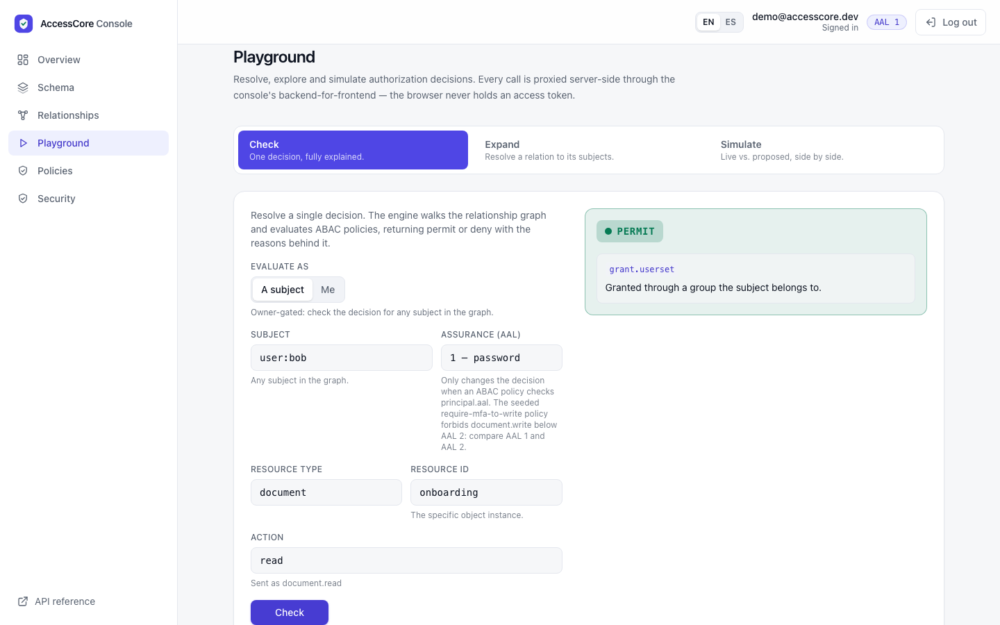
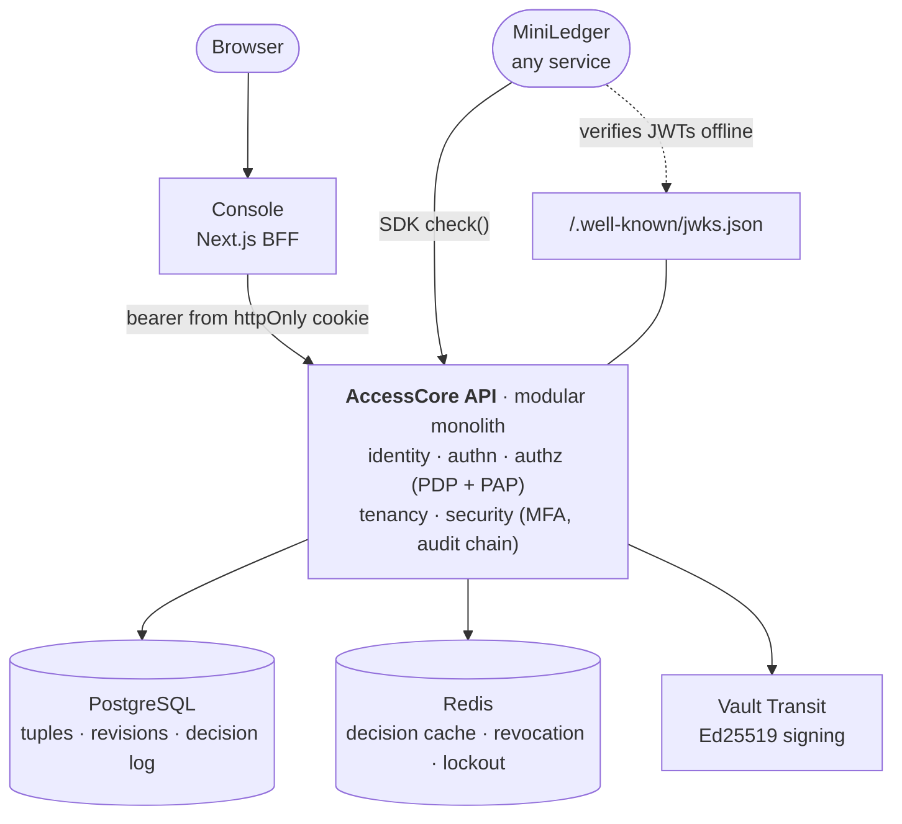
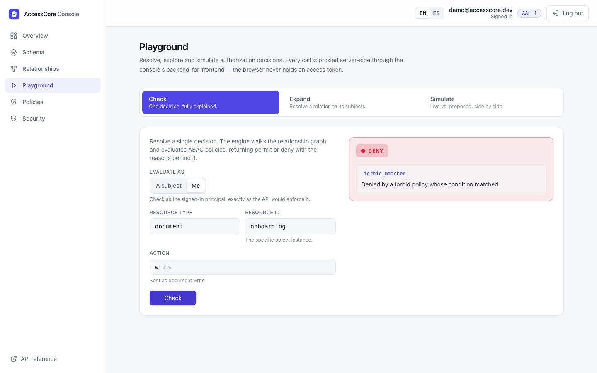
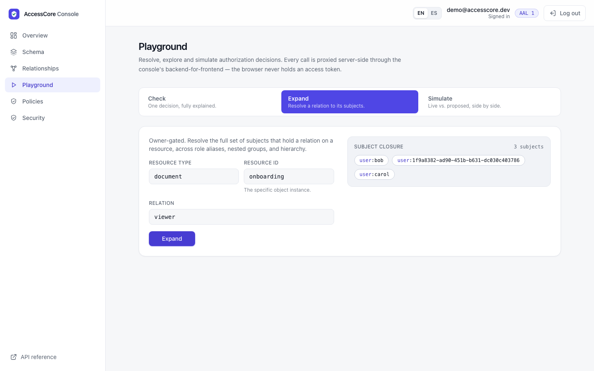
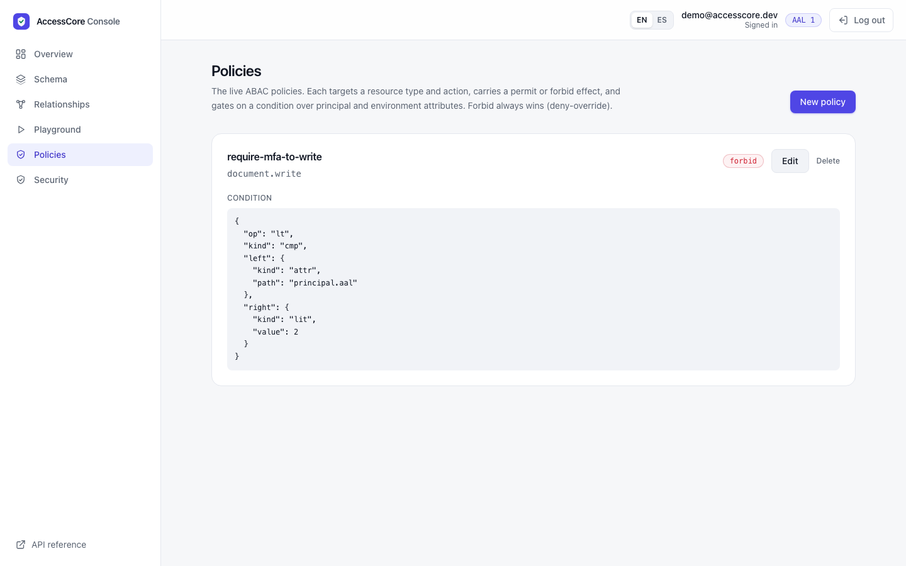
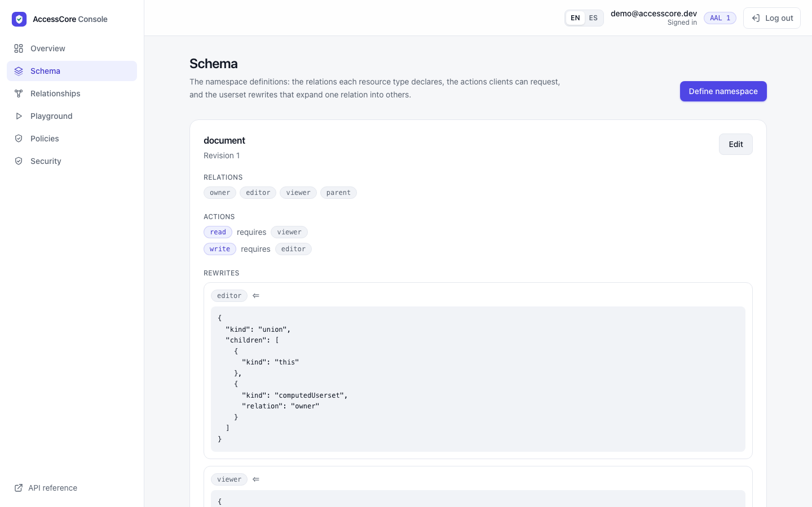
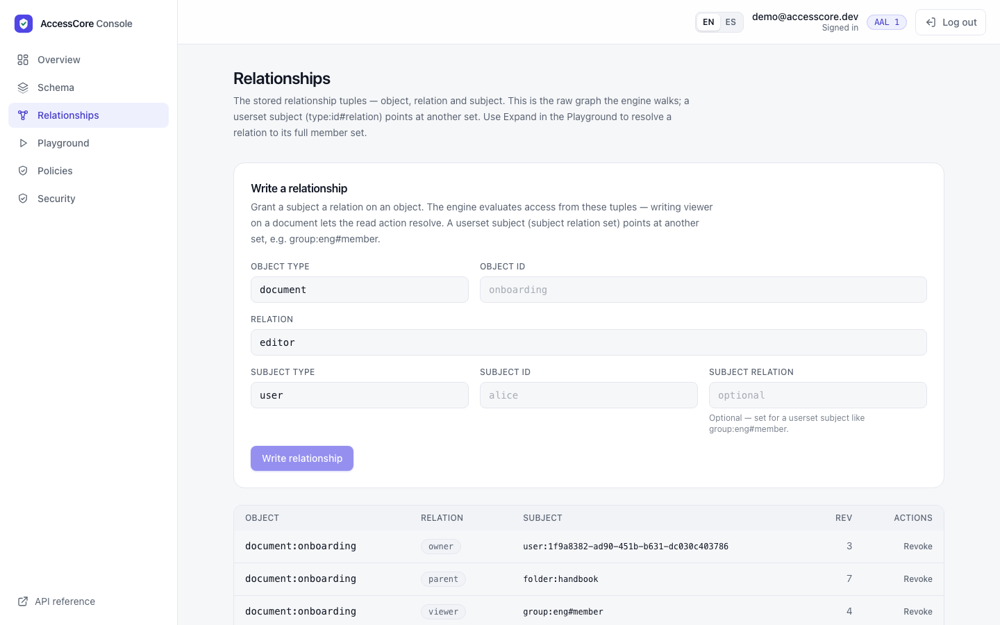

# AccessCore

**A self-hostable identity and authorization platform with a hybrid ReBAC + RBAC + ABAC policy
engine.** Zanzibar-style relationships, IAM-style deny-override, and Cedar-like conditions are
resolved in one call that is correct, deterministic, explainable, and consistent under concurrent writes.

[](https://github.com/diegowritescode/accesscore/actions/workflows/ci.yml)
[](https://github.com/diegowritescode/accesscore/actions/workflows/security.yml)
[](https://github.com/diegowritescode/accesscore/actions/workflows/release.yml)
[](https://github.com/diegowritescode/accesscore/actions/workflows/smoke.yml)


[](LICENSE)

|                   |                                                                                                      |
| ----------------- | ---------------------------------------------------------------------------------------------------- |
| **Admin console** | [console.deviego.xyz](https://console.deviego.xyz)                                                   |
| **API reference** | [auth.deviego.xyz/reference](https://auth.deviego.xyz/reference) (OpenAPI, try it in the browser)    |
| **Demo login**    | `demo@accesscore.dev` / `correct horse battery staple` (shared, restricted, reset nightly)           |
| **In production** | [MiniLedger](https://github.com/diegowritescode/miniledger) authorizes every ledger call via the SDK |



## Where to look first

- **The decision engine is a pure function.** [`evaluate.ts`](apps/api/src/authz/domain/evaluate.ts)
  is total and deterministic, with no I/O and no framework. It is property-tested with `fast-check`
  (deny-by-default, tenant isolation, cycle safety, check/expand agreement) and mutation-tested with
  Stryker ([ADR-012](docs/adr/012-pdp-evaluation-algorithm.md), [ADR-015](docs/adr/015-userset-rewrites-and-rebac-evaluation.md)).
- **No "new enemy" problem.** Every write advances a commit-ordered revision under a Postgres advisory
  lock. A `check` can require "at least this fresh", and the decision cache is keyed by revision, so a
  revoked grant is never served from a stale snapshot
  ([ADR-004](docs/adr/004-authorization-consistency-model.md), [ADR-023](docs/adr/023-decision-cache-consistency-model.md)).
- **Fail-closed by construction.** Unknowns deny, a `forbid` wins regardless of order, a truncated
  negative operand never opens access, and a PDP error returns `503`, never `permit`
  ([ADR-016](docs/adr/016-abac-policy-and-deny-override.md)).
- **Keys the process cannot leak.** Ed25519 signing happens inside Vault Transit, and the API never
  holds private key material ([ADR-009](docs/adr/009-key-management-and-cryptography.md)).
- **Measured, not claimed.** `check` runs at p50 1.3 ms with the decision cache (k6, [`performance.md`](docs/performance.md)).
  Merged unit + integration + e2e coverage is about 95%. The live instance runs immutable,
  SHA-tagged images with a least-privilege DB role and a tamper-evident audit hash chain
  ([ADR-027](docs/adr/027-container-release-and-shared-edge-deployment.md), [ADR-018](docs/adr/018-least-privilege-db-role.md), [ADR-021](docs/adr/021-tamper-evident-audit.md)).

## Architecture at a glance



Each module is split into domain, application, infrastructure, and interface layers, and
[dependency-cruiser](apps/api/.dependency-cruiser.cjs) fails the build if a domain file imports a framework or
an adapter. Full detail is in [`docs/architecture.md`](docs/architecture.md), and every significant
decision is recorded as an ADR in [`docs/adr/`](docs/adr/).

<details>
<summary><b>More screenshots</b>: deny-override, expand, schema, relationships, policies</summary>

|                                                                                                                                       |                                                                                                                                                  |
| ------------------------------------------------------------------------------------------------------------------------------------- | ------------------------------------------------------------------------------------------------------------------------------------------------ |
|  |  |
|                         |                                             |
|                   |                                                                                                                                                  |

</details>

## Business problem

Most applications reinvent auth badly and it collapses under real requirements: resource-level
permissions a role enum can't express, relationship-based sharing, conditional access
(MFA / IP / time), safe delegated administration in multi-tenant systems, and access that is
auditable, provable, and revocable. AccessCore unifies the three dominant models — AWS IAM
(deterministic deny-override), Google Zanzibar (ReBAC at scale), and AWS Cedar (analyzable
policy) — into one engine, so the rest of the portfolio's services get one hardened identity
layer instead of re-implementing auth per service. Full context in
[`docs/business-context.md`](docs/business-context.md).

## What works today (shipped)

- **Identity + password auth** — `User` aggregate, **Argon2id** hashing, timing-safe compare, a
  dummy-verify path for unknown users, and anti-enumeration on register/login/reset.
- **Account lifecycle** — email verification and secure single-use, hashed, expiring password
  reset; lifecycle events revoke sessions. Delivery goes through a `Mailer` port; the live demo
  binds a log-only adapter, so reviewers use the seeded demo account
  ([trade-off](docs/trade-offs.md#log-only-mail-adapter-on-the-live-demo)).
- **Token platform** — asymmetric **EdDSA** JWTs with `iss`/`aud`/`exp`/`nbf` binding and bounded
  clock skew; a live **JWKS** endpoint with `kid → alg` binding and cache headers; short-lived
  access tokens carrying identity + assurance level (never authorization verdicts).
- **Sessions & revocation** — device-bound sessions; list/revoke your sessions; logout /
  logout-all; refresh **rotation + reuse detection** (family revoke); a Redis blocklist checked by
  a PEP guard after JWT verification (fail-closed, TTL-bounded for offline verifiers).
- **Tenancy** — global identity with per-organization membership; the active `org` is a verified
  token claim, and org-scoping is enforced at every authorization traversal hop.
- **PDP — the hybrid engine** — a Postgres relationship-tuple store with commit-ordered revisions;
  rewrite-aware namespace definitions (`this` / `computed_userset` / `tuple_to_userset` / `union` /
  `intersection` / `exclusion`); a pure evaluator resolving direct grants, role aliases, hierarchy,
  and bounded nested groups; **ABAC** conditions over principal/environment attributes with
  `forbid` **deny-override**, permission boundaries and org guardrails; `check`, `expand`,
  shared-snapshot `batchCheck`, and `simulate` (live-vs-overlay diff) — all reading at a revision,
  honoring consistency tokens, and writing a decision log.
- **Enforcement** — `POST /authz/check` / `batch-check` / `expand` / `simulate` (token-derived
  principal) and the in-process `@RequirePermission` guard; a **published typed SDK**
  (`createClient(...).check(...)` and `AccessCoreModule.forRoot()` + a remote `@RequirePermission`).
- **Policy administration (PAP)** — owner-gated `PUT /authz/namespaces/:ns`,
  `POST`/`DELETE /authz/tuples`, and `PUT`/`DELETE /authz/policies/:id`, condition-validated at
  write time; plus owner-gated read/discovery endpoints.
- **Account security** — TOTP MFA (enroll → activate → single-use recovery codes → disable),
  **step-up** to AAL 2, per-account/per-IP/per-MFA **lockout** (Redis, atomic), and a
  **tamper-evident audit hash chain** with an owner-gated `GET /authz/audit/verify`.
- **Admin console** (Next.js) — a token-safe backend-for-frontend (httpOnly cookie, never exposed
  to the browser): dashboard, schema/relationships/policies **read and write** screens, an
  Authorization **Playground** (`check` / `expand` / `simulate` with a condition builder), account
  security (MFA + audit verifier), and an **EN/ES** toggle.
- **Watch API** — `GET /authz/watch` streams relationship-tuple changes over **SSE**, backed by a
  durable changelog written in the same transaction as the tuple write. Deletions become observable
  (the tuple table hard-deletes), every event id is a **consistency token** usable both as the
  resume cursor and as a `check` zookie, and `Last-Event-ID` resumption is automatic
  ([ADR-025](docs/adr/025-watch-api-and-tuple-changelog.md)).
- **Hot-path scale work** — a **revision-keyed decision cache** (Redis) that caches only
  context-independent decisions, so a write to any tuple/policy invalidates it implicitly and a
  cached `permit` can never bypass a later step-up ([ADR-023](docs/adr/023-decision-cache-consistency-model.md)),
  an **async batched decision log** that keeps the audit insert off the check hot path while
  degrading to synchronous writes rather than losing entries
  ([ADR-024](docs/adr/024-async-decision-log.md)), and a **Leopard-style flattened membership
  index**: an async materializer keeps each group's transitive members, and a check through nested
  groups becomes one lookup instead of one query per level. It is gated per tenant on a revision
  watermark, so a stale index can only fail to accelerate, never change a decision
  ([ADR-026](docs/adr/026-leopard-flattened-membership-index.md)).
- **Observability** — a Prometheus `GET /metrics` floor: process/runtime metrics, per-route HTTP
  latency, **authz-domain** metrics (`authz_decisions_total{effect}`, PDP latency), and
  decision-log writer health (buffer depth, flush lag, degraded/dropped counts); structured
  pino logs with correlation IDs.
- **Hardening** — `helmet` headers, per-IP rate limiting (tighter on `login`/`refresh`), a 32 KB
  body limit and DTO length caps, boot-time config validation, production guards that refuse the
  software signer and the dev Vault token, and a **least-privilege runtime DB role** with
  `REVOKE UPDATE, DELETE` on the append-only decision log / revisions / audit tables.

## Workspace layout

A pnpm + Turborepo workspace (one repo; not a monorepo of many products):

```
apps/
  api/          NestJS API — identity, authn, authz (PDP+PAP), tenancy, security, observability
  console/      Next.js admin console — read/write screens, Playground, account security, EN/ES
packages/
  sdk/          @diegowritescode/accesscore-sdk — typed client + NestJS PEP
  contracts/    shared wire DTOs (Decision, ResourceRef, reason codes)
docs/           business context, architecture, data model, security, testing, observability, ADRs
```

The PDP evaluator lives in `apps/api/src/authz/domain` as pure functions with no IO. It moves into
its own package only when the SDK needs offline/edge evaluation (the documented extraction trigger
in [ADR-011](docs/adr/011-pdp-core-location.md)/[ADR-013](docs/adr/013-cross-service-authorization-contract.md)).

## Tech stack

Node.js 22 · TypeScript · NestJS 11 · **Drizzle ORM** · PostgreSQL 16 · Redis 7 ·
**HashiCorp Vault 1.18** (Transit) · **Next.js 15** · `prom-client` · pnpm + Turborepo · Jest ·
`fast-check` · `nyc` · GitHub Actions · Docker.

## Data model

Domain-first: pure aggregates and value objects (`Email`, `PasswordHash`, `EntityRef`, `Action`,
`Userset`, `Condition`, `Revision`, …) mapped to rows by hand-written Drizzle adapters. Core
aggregates: `User` (global identity), `Session` / `TokenFamily` / `RefreshToken`, `Organization` /
`Membership`, `MfaCredential` / `RecoveryCode`, and the authz core — `RelationTuple`,
`NamespaceDefinition`, `Policy`, `DecisionLog`, the tamper-evident `security_audit` chain — plus a
`revisions` changelog backing consistency tokens. Detail and the ERD in
[`docs/data-model.md`](docs/data-model.md).

## Security

Security is the product. Enforced today: Argon2id + timing-safe compare + dummy verify;
anti-enumeration; asymmetric token signatures over a published JWKS with `iss`/`aud`/`exp`/`nbf`
binding; refresh reuse detection; a TTL-bounded revocation blocklist; per-IP rate limiting and
per-account/per-IP lockout; `helmet`; body/DTO caps; fail-fast production config guards;
non-exportable Vault Transit signing; object-level authorization via the PDP (IDOR/BOLA
prevention); ABAC conditions and `forbid` deny-override; TOTP **MFA + step-up**; a least-privilege
runtime DB role; and a **tamper-evident audit hash chain** (SHA-256, advisory-lock-serialized,
re-verifiable). The threat model (STRIDE, token defenses, standards alignment) is in
[`docs/security.md`](docs/security.md); vulnerabilities go through [`SECURITY.md`](SECURITY.md).

## Testing strategy

A three-layer pyramid, all determinism-first (the `Clock` is an injected port — no wall-clock
sleeps):

- **Unit** (`jest`) — pure domain + application logic with injected fakes; the bulk of the
  assertions, including **property-based** tests (`fast-check`) of the evaluator (totality,
  deny-by-default, determinism, tenant isolation, cycle safety, check/expand agreement, and the
  fail-closed asymmetry of `forbid`/condition evaluation).
- **Integration** — adapters against **real** Postgres / Redis / Vault via docker-compose (DB
  constraints, row-level concurrency, Vault Transit signing + rotation, Redis TTLs, the
  advisory-locked audit chain, the least-privilege role's `REVOKE`s).
- **E2E** — full HTTP flows through the booted Nest app: blocklisted-but-valid JWT rejected, reuse
  cascade, `@RequirePermission` deny/permit, the `/authz/*` semantics, MFA + step-up, lockout, the
  audit verifier, and the Prometheus `/metrics` surface.
- **Browser** (Playwright) — the console's journeys through the real BFF and API: sign-in/out,
  Playground check and expand, the AAL step-up policy, EN/ES. The read-only `@smoke` subset runs
  **hourly against the live instance** (`Production smoke` badge above).

Coverage is collected from all three suites and **merged** (`nyc`), so an adapter exercised only by
integration/e2e still counts. Current merged figures on core logic: **96.1% lines ·
95.7% statements · 92.7% functions · 87.0% branches** (CI run on `main`, 2026-10-01), above the CI gate floor
(`lines 90 / statements 90 / functions 85 / branches 75`, a ratchet that only rises). Suite sizes:
**465 unit + 96 integration + 84 e2e** (API), **14** SDK tests, and **10** Playwright browser journeys. Detail in
[`docs/testing-strategy.md`](docs/testing-strategy.md).

## Deployment

`docker compose up` boots Postgres 16, Redis 7, and Vault 1.18 from a clean clone; migrations run
via `pnpm --filter @accesscore/api db:migrate`; config is validated at boot and production refuses
the software signer and the dev Vault token. **The API is deployed at
[auth.deviego.xyz](https://auth.deviego.xyz) and the console at
[console.deviego.xyz](https://console.deviego.xyz)** — images built once in CI, published to
GHCR under the commit SHA, and run by a versioned Compose file behind Traefik with Let's Encrypt TLS
([ADR-027](docs/adr/027-container-release-and-shared-edge-deployment.md)). The step-by-step recipe is
[`docs/deploy-vps.md`](docs/deploy-vps.md); the deployment model, `/metrics` scraping, and
local setup are in [`docs/deployment.md`](docs/deployment.md) and
[`docs/observability.md`](docs/observability.md).

## Trade-offs

The significant decisions and the costs accepted (modular monolith vs microservices, Drizzle vs
TypeORM, the throughput-bounded advisory-lock revision, the revision-keyed decision cache, the
async batched decision log, the
bounded-depth evaluator, the operator-tree rewrite model, session-owned AAL, an open `/metrics`
scrape target, token-forwarding vs on-behalf-of, Vault Transit signing) are consolidated in
[`docs/trade-offs.md`](docs/trade-offs.md), each pointing at the ADR that owns it.

## Status & roadmap

Capabilities land as **vertical slices** (each end-to-end: domain → API → tests → CI), then
concentric **rings** in value order. Deferring a ring is a decision, not an omission
([`docs/scope-and-roadmap.md`](docs/scope-and-roadmap.md)).

| Slice | Scope                                                                                                                                          | Status      |
| ----- | ---------------------------------------------------------------------------------------------------------------------------------------------- | ----------- |
| 0     | Walking skeleton — health/readiness, config validation, first migration, docker-compose, CI                                                    | **Shipped** |
| 1     | Identity + password auth — `User`, Argon2id, register/verify/reset, anti-enumeration                                                           | **Shipped** |
| 2     | Token platform — EdDSA JWT + JWKS + rotation, refresh reuse detection, sessions, revocation                                                    | **Shipped** |
| 2.5   | Tenancy + hardening — orgs/membership, throttling, `helmet`, prod config guards, Vault Transit                                                 | **Shipped** |
| 3     | PDP v1 + SDK — tuple store, namespace config, pure evaluator + `expand`, `check` + zookies + decision log, `@RequirePermission`, published SDK | **Shipped** |
| 4     | PDP v2 (ReBAC) — userset rewrites (`computed_userset` / `tuple_to_userset`), nested-group recursion, shared-snapshot `batchCheck`              | **Shipped** |
| 5     | PDP v3 (ABAC) — Cedar-like condition DSL, `forbid` deny-override, permission boundaries, org guardrails, `simulate`                            | **Shipped** |
| 6     | Account security & audit — TOTP MFA + step-up (AAL 2), per-account/per-IP lockout, tamper-evident audit hash chain                             | **Shipped** |
| 7     | Admin console (Next.js) — read + write screens (schema/relationships/policies), Authorization Playground, account security, EN/ES              | **Shipped** |
| 8     | Observability & ops floor — Prometheus `/metrics` (HTTP + authz-domain), least-privilege DB role, structured pino logging                      | **Shipped** |
| Scale | Zanzibar-scale ring — revision-keyed decision cache, async batched decision log, Watch API (SSE tuple changelog), Leopard membership index     | **Shipped** |
| Rings | Passkeys · RFC 8693 token exchange · service accounts · full OIDC provider + federation + SCIM · access analyzer/reviews/SoD · HA              | Planned     |

## Quick start

```bash
corepack enable                 # or ensure pnpm 9.x is installed
pnpm install
cp apps/api/.env.example apps/api/.env   # the API loads this at startup
docker compose up -d            # Postgres 16, Redis 7, Vault 1.18 (dev mode)
pnpm --filter @accesscore/api db:migrate
pnpm --filter @accesscore/api seed  # optional: a demo authorization graph to explore (see Demo)
pnpm --filter @accesscore/api dev   # NestJS API in watch mode on :3000
pnpm --filter @accesscore/console dev   # Next.js console on :3001 (optional)
```

Health: `GET /health` (liveness), `GET /ready` (readiness — pings Postgres). Interactive API
reference (Scalar, rendered from the OpenAPI document): `GET /reference`. Prometheus metrics:
`GET /metrics`.

Development commands:

```bash
pnpm lint        # ESLint across the workspace
pnpm typecheck   # tsc --noEmit
pnpm test        # unit tests
pnpm build       # build all packages/apps
pnpm --filter @accesscore/api coverage   # merged unit+integration+e2e coverage + gate
pnpm --filter @accesscore/console test:e2e   # Playwright journeys (starts the API and console)
```

Contribution conventions and quality gates are in [`CONTRIBUTING.md`](CONTRIBUTING.md); community
expectations in [`CODE_OF_CONDUCT.md`](CODE_OF_CONDUCT.md).

## Demo — the hybrid engine over HTTP

`pnpm --filter @accesscore/api seed` provisions a demo org, a `document` namespace with **userset
rewrites**, and a relationship graph that exercises all three ReBAC mechanisms, then prints a demo
login. It is idempotent, so it is safe to re-run.

The seeded graph on `document:onboarding` — one document reachable three different ways:

- **role aliasing** — the demo user is the `owner`; the namespace rewrites `owner ⇒ editor ⇒ viewer`
  (`computed_userset`), so the owner can `read` without a direct `viewer` tuple.
- **nested groups** — `user:bob` ∈ `group:eng-leads` ∈ `group:eng`, and `group:eng` is a `viewer` of
  the document — resolved across two userset levels.
- **hierarchy** — the document's `parent` is `folder:handbook`, and `user:carol` is a `viewer` of
  that folder, so she inherits view on the document (`tuple_to_userset`).

```bash
API=http://localhost:3000                       # or the live deploy
pnpm --filter @accesscore/api seed              # local only; prints the demo credentials

TOKEN=$(curl -sS -X POST "$API/auth/login" \
  -H 'content-type: application/json' \
  -d '{"email":"demo@accesscore.dev","password":"correct horse battery staple"}' | jq -r .access_token)

# check: the owner can read — resolved through owner -> editor -> viewer
curl -sS -X POST "$API/authz/check" \
  -H "authorization: Bearer $TOKEN" -H 'content-type: application/json' \
  -d '{"action":"document.read","resource":{"type":"document","id":"onboarding"}}'
# -> {"effect":"permit","reasons":[{"code":"grant.computed_userset",
#      "message":"Subject user:<you> holds viewer on document:onboarding."}]}

# expand: who can view this document, resolved across every rewrite?
curl -sS -X POST "$API/authz/expand" \
  -H "authorization: Bearer $TOKEN" -H 'content-type: application/json' \
  -d '{"resource":{"type":"document","id":"onboarding"},"relation":"viewer"}'
# -> {"subjects":[
#      {"type":"user","id":"bob"},        # nested groups: eng-leads < eng < document viewer
#      {"type":"user","id":"<you>"},      # role aliasing: owner -> editor -> viewer
#      {"type":"user","id":"carol"}       # hierarchy: folder:handbook viewer -> document viewer
#    ]}
```

Every `permit` carries its **derivation**: `reasons[].code` names the mechanism (`grant.direct` /
`grant.userset` / `grant.computed_userset` / `grant.tuple_to_userset` / `grant.indexed_userset`)
and, on a `check`,
`reasons[].path` is the exact chain of tuples that granted it — the explainability that feeds the
decision log and the Authorization Playground.

The seed also writes one ABAC policy, `require-mfa-to-write`: a `forbid` on `document.write`
whenever `principal.aal < 2`. The owner still holds `editor`, yet a `check` of `document.write` at
AAL 1 returns `deny` with `forbid_matched`, and the same check at AAL 2 returns `permit`. Try it in
the console Playground by switching the assurance level, which is deny-override in one click.

Author the graph and policies yourself over HTTP through the owner-gated **Policy Administration
Point** (`PUT /authz/namespaces/:ns`, `POST`/`DELETE /authz/tuples`,
`PUT`/`DELETE /authz/policies/:id`, [ADR-014](docs/adr/014-policy-administration-point.md)) — or
through the **[admin console](https://console.deviego.xyz)** — and query it with
`POST /authz/check`, `/authz/expand`, `/authz/batch-check`, and `/authz/simulate`. Add an ABAC
`forbid` that requires `principal.aal >= 2` and watch a `check` flip to `deny` until you step up
your session with MFA. See [`docs/api.md`](docs/api.md) for the full surface and SDK usage.

## License

[Apache-2.0](LICENSE).
